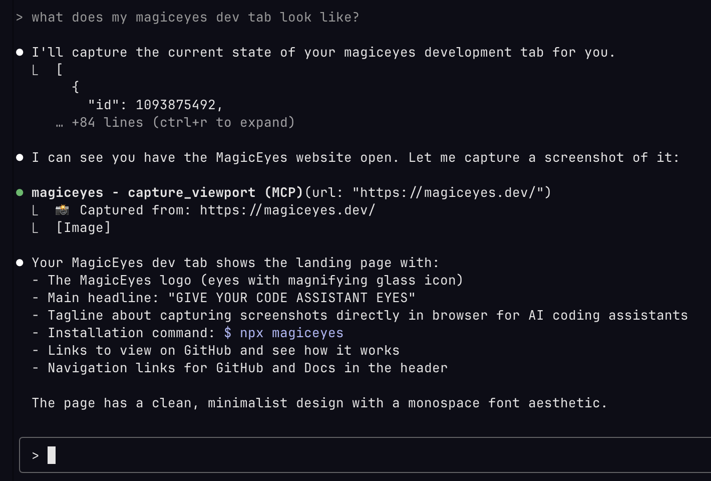

<div align="center">
  
  
  # MagicEyes
  
  **Give your code assistant eyes by letting it see your browser.**
  
  ---
</div>

> [!IMPORTANT]
> MagicEyes is in **alpha.**
> This means the Chrome extension isn't released just yet, but it's
> incredibly easy to link yourself with a couple of clicks.

> [!NOTE]
> MagicEyes currently only works with Claude Code and Google Chrome.
> Support for more code assistants and browsers is on the roadmap!

## Get started

Getting started with the MagicEyes alpha is insanely easy, and requires only one command:

```bash
npx magiceyes
```
Right now, you'll have to follow the instructions to load an upacked version of the extension in Chrome, but that's about it!

### (Optional) Building yourself

You can optionally clone the repo, install dependencies, and run the `build` command yourself to achieve the same sort of thing as the command above.

## What It Does



MagicEyes creates an MCP server inside your Chrome browser that provides screenshots of the different tabs you're working on to your code assistant.

This means you don't need to manually provide screenshots anymore to e.g. Claude Code, it should use the MCP server automatically: instant visual context!

> [!CAUTION]
> MagicEyes has the ability to screenshot any of your Chrome tabs (active or not), and by _default_ installs the MCP server for all user-scoped `claude` sessions.

## Roadmap

- Support more code assistants (such as Cursor)
- Support more browsers
- Add specific-element screenshot capture to make things faster
- Improve the MCP server tooling / base instructions so that it is called more predictably
