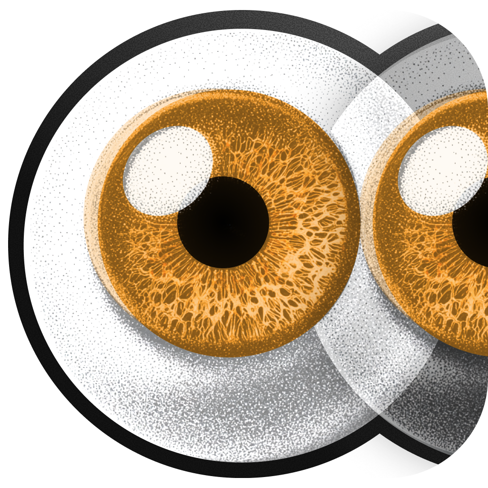

<div align="center">
  
  
  # MagicEyes
  
  
  **Give your code assistant eyes by letting it see your browser.**
  
  ---
</div>

```bash
npx magiceyes
```


> [!IMPORTANT] 
> MagicEyes is in **alpha.**
> This means the Chrome extension isn't released just yet, but it's
> incredibly easy to link yourself in one command / a couple of clicks.

> [!NOTE]
> MagicEyes currently only works with Claude Code and Google Chrome.
> Support for more code assistants and browsers is on the roadmap!

## What It Does

MagicEyes lets AI coding assistants see your browser. Click the extension, capture any page, ask Claude "what do you see?"

No screenshots folder. No drag and drop. Just instant visual context.

## Install

```bash
npx magiceyes
```

The setup wizard:

1. Configures Claude automatically
2. Opens Chrome extension install
3. Tests the connection

That's it. 30 seconds.

## How It Works

```
Browser → Extension → MCP Server → Claude
```

Click icon. Capture page. Claude sees it. Done.

## Development

```bash
git clone https://github.com/rorz/magiceyes.git
cd magiceyes
pnpm install
pnpm run build
```

## Links

- [Documentation](https://magiceyes.dev)
- [Chrome Extension](https://chrome.google.com/webstore/detail/magiceyes) (coming soon)
- [NPM Package](https://www.npmjs.com/package/magiceyes)
- [Issues](https://github.com/rorz/magiceyes/issues)

## License

MIT © Rory

---

**Stop describing. Start showing.**
